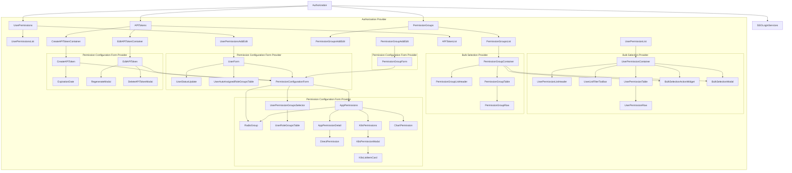

```mermaid
graph TD;
  Authorization-->SSOLoginServices;
  Authorization-->UserPermissions;
  Authorization-->PermissionGroups;
  Authorization-->APITokens;

  subgraph "Authorization Provider"
    UserPermissions-->UserPermissionsList;
    UserPermissions-->UserPermissionsAddEdit;

    UserPermissionList-->UserPermissionContainer

    subgraph "Bulk Selection Provider"
      UserPermissionContainer-->UserPermissionListHeader;
      UserPermissionContainer-->UserListFilterToolbar;
      UserPermissionContainer-->UserPermissionTable;
      UserPermissionContainer-->BulkSelectionActionWidget;
      UserPermissionContainer-->BulkSelectionModal;

      UserPermissionTable-->UserPermissionRow
    end

    UserPermissionsAddEdit-->UserForm;

    subgraph "Permission Configuration Form Provider"
      UserForm-->UserStatusUpdate;
      UserForm-->UserAutoAssignedRoleGroupsTable;
      UserForm-->PermissionConfigurationForm;
    end

    PermissionGroups-->PermissionGroupsList;
    PermissionGroups-->PermissionGroupsAddEdit;

    PermissionGroupsList-->PermissionGroupContainer

    subgraph "Bulk Selection Provider"
      PermissionGroupContainer-->PermissionGroupListHeader;
      PermissionGroupContainer-->PermissionGroupTable;
      PermissionGroupContainer-->BulkSelectionActionWidget;
      PermissionGroupContainer-->BulkSelectionModal;

      PermissionGroupTable-->PermissionGroupRow
    end

    PermissionGroupAddEdit-->PermissionGroupForm;

    subgraph "Permission Configuration Form Provider"
      PermissionGroupForm-->PermissionConfigurationForm;
    end

    APITokens-->APITokenList;
    APITokens-->CreateAPITokenContainer;
    APITokens-->EditAPITokenContainer;

    CreateAPITokenContainer-->CreateAPIToken
    EditAPITokenContainer-->EditAPIToken

    subgraph "Permission Configuration Form Provider"
      CreateAPIToken-->ExpirationDate;
      CreateAPIToken-->PermissionConfigurationForm;

      EditAPIToken-->PermissionConfigurationForm;
      EditAPIToken-->RegenerateModal;
      EditAPIToken-->DeleteAPITokenModal;
    end

    subgraph "Permission Configuration Form Provider"
      PermissionConfigurationForm-->RadioGroup;
      PermissionConfigurationForm-->UserPermissionGroupsSelector;
      PermissionConfigurationForm-->AppPermissions;

      UserPermissionGroupsSelector-->UserRoleGroupsTable;

      AppPermissions-->RadioGroup;
      AppPermissions-->AppPermissionDetail;
      AppPermissions-->K8sPermissions;
      AppPermissions-->ChartPermission;

      AppPermissionDetail-->DirectPermission

      K8sPermissions-->K8sPermissionModal

      K8sPermissionModal-->K8sListItemCard
    end
  end
```
