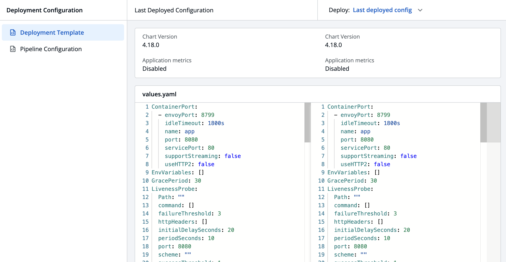
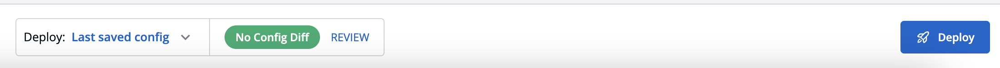

# CDMaterials Documentation

-   Step - 1 : Computes Render
-   Step - 2: Computes **isApprovalConfigured**
-   Step - 3: If materials.length>0 then **Flow - 1** else **Flow -2**

## Flow-1

Renders two different view:

1. If coming from bulkCD render **triggerBody**
2. Otherwise render **CDModal**

### renderTriggerBody:

This function is the essence of this whole component, it contains three logical parts:

-   TriggerViewConfigDiff
-   renderMaterialList
-   Fetch more images in rollback.

Coming to each components:

-   **TriggerViewConfigDiff**: This component is responsible for rendering the following view
    

-   **renderMaterialList:** This is a function returning JSX.Element containing list of materials, This function internally calls another function called **getConsumedAndAvailableMaterialList** which would contain the list of materials after filtering all the materials according to constraints. After that we compute the text to be shown on header and calls the renderMaterial function to render the material items with their detailing like Excluded state, add action button like expire approval, etc.
-   **Load more:** This section aims to fetch more images from the server. This will be beneficial in case user wants more than N latest images, we will trigger load more function from which we will be fetching images from server, minding the fact that user can’t get images more than the configured set of number set in config map of devtron image. For that we will also be putting a check on the current length of materials and the limit we get from the API.

### renderCDModal:

1. Renders the header, if showing config view, it will render :
   

    Otherwise it will render the basic header using renderCDModalHeader

2. It renders trigger body using renderTriggerBody.
3. It renders renderTriggerModalCTA, This function is going to render the footer

    

## Flow-2

Showing Empty states for two cases: BulkCD, CD

Inside the empty states as well there are other cases:

-   searchImageTag: Based on this we show that on given search input we have no material.
-   Based on length of eligible images passing filters we will be showing the empty state.
-   Based on approvals there is going to be a state.
-   Default empty state.
