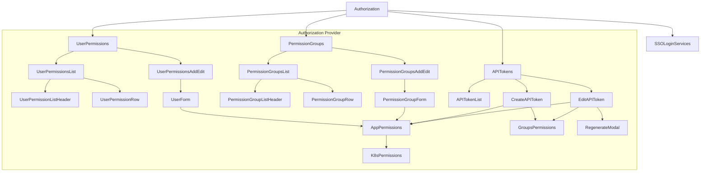

```mermaid
graph TD;
  Authorization-->SSOLoginServices;
  Authorization-->UserPermissions;
  Authorization-->PermissionGroups;
  Authorization-->APITokens;

  subgraph "Authorization Provider"
    UserPermissions-->UserPermissionsList;
    UserPermissions-->UserPermissionsAddEdit;

    UserPermissionsList-->UserPermissionListHeader;
    UserPermissionsList-->UserPermissionRow;

    UserPermissionsAddEdit-->UserForm;
    UserForm-->AppPermissions;

    PermissionGroups-->PermissionGroupsList;
    PermissionGroups-->PermissionGroupsAddEdit;

    PermissionGroupsList-->PermissionGroupListHeader;
    PermissionGroupsList-->PermissionGroupRow;

    PermissionGroupsAddEdit-->PermissionGroupForm;
    PermissionGroupForm-->AppPermissions;

    APITokens-->APITokenList;
    APITokens-->CreateAPIToken;
    APITokens-->EditAPIToken;

    CreateAPIToken-->GroupsPermissions;
    CreateAPIToken-->AppPermissions;

    EditAPIToken-->GroupsPermissions;
    EditAPIToken-->RegenerateModal;
    EditAPIToken-->AppPermissions;

    AppPermissions-->K8sPermissions;
  end
```
